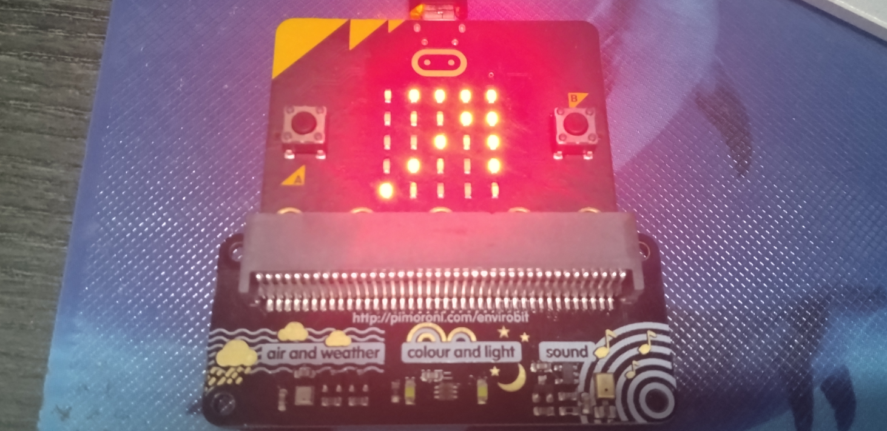
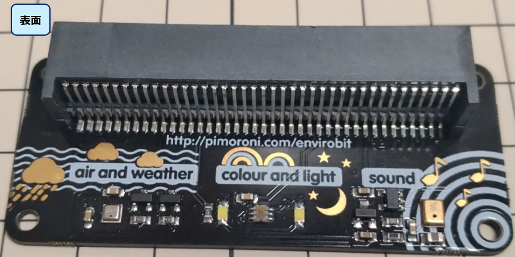
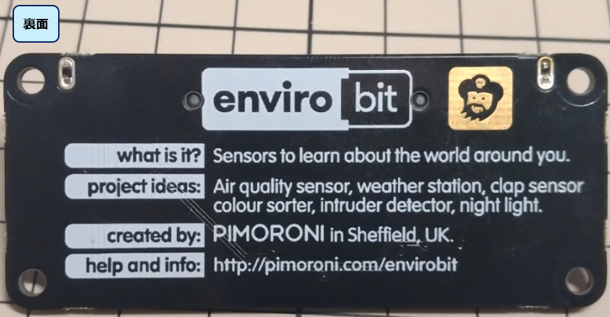
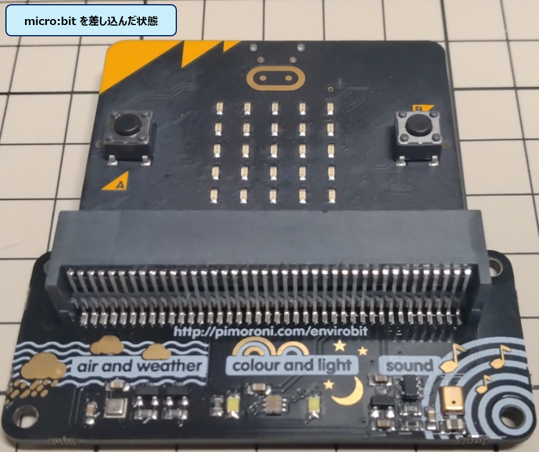
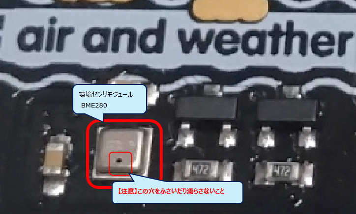
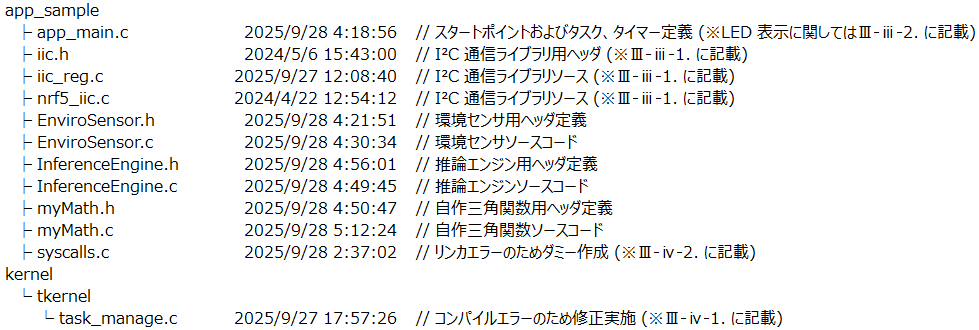
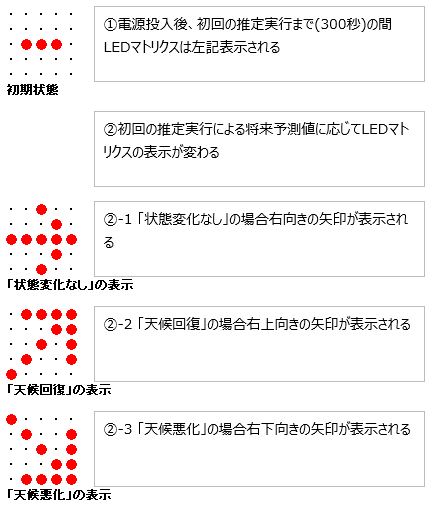

# 「AMAGOI」動作説明・操作マニュアル

## Ⅰ.概要  
環境データ推論システム「AMAGOI(あまごい)」は、環境センサからの入力を基に一定期間後の状態を予測して出力するシステムである。  
状態予測は気圧および湿度の観測実測値および推論エンジンにより算出された将来予測値を用いて行う。

## Ⅱ.ハードウェア構成
### Ⅱ-ⅰ.使用するハードウェア
1. micro:bit
2. Pimoroni 製 enviro:bit  
   https://shop.pimoroni.com/products/enviro-bit?variant=3142289653770  
  
**fig2-1 enviro:bit(表面)**
  
**fig2-2 enviro:bit(裏面)**  

### Ⅱ-ⅱ.組立手順
1. enviro:bit の表面と micro:bit のマトリクス LED のある面を合わせ、enviro:bit に差し込む(fig2-3 参照)  
  
**fig2-3 組み立て後の状態**

### Ⅱ-ⅲ.注意事項
1. emviro:bit に搭載された環境センサモジュール BME280 の穴をふさいだり、濡らさないこと。  
  
**fig2-4 BME280 モジュール**  

## Ⅲ.ソフトウェア構成
### Ⅲ-ⅰ.ダウンロード元
1. 必要なソフトウェアコードはこのリポジトリもしくは以下の URL よりダウンロードできる。
https://drive.google.com/drive/folders/1OghZdNLMy32zUal7xh9D6cPuL1vC0B1t?usp=drive_link

2. ファイル構成を fig3-1 に示す。
  
**fig3-1 ソースファイル構成**  

3. このリポジトリ内に説明資料(本文書)、システム概要説明スライドおよび動作イメージ(動画)が格納されているため、適宜参照すること。
   ・AMAGOI.pptx
   ・AMAGOI.mp4
   ・AMAGOI.pdf (本文書)  

### Ⅲ-ⅱ.環境構築手順
IoTエッジノード実践キット附属の『μT-Kernel3.0 micro:bit v2 向け 構築手順書(Version.01.00.01)』 「3. 開発環境と構築手順」記載の手順に従い環境構築を実施しているため、左記資料の手順に従って構築を実施すること。  
上記実施後、Ⅲ-ⅰにてダウンロードした zip ファイルを展開後、「eclipse-workspace\mtkernel_3\app_sample\」以下の全ファイルおよび
「eclipse-workspace\mtkernel_3\kernel\tkernel\task_manage.c」を上書きすること。

IoTエッジノード実践キット  
https://www.personal-media.co.jp/webshop/tengine/ioten_prackit_hw.html  

### Ⅲ-ⅲ.利用した外部ライブラリ
本ソフトウェア作成にあたり、以下のライブラリを利用している。なお、本ソフトウェアの環境に合わせ一部改変を実施している。  
また、本ソフトウェアの利用条件を充足しており権利処理については問題ないことを本ソフトウェア作成者の責任において保証する。

1. I²C 通信用ライブラリ(iic.h / iic_reg.c / nrf5_iic.c)  
   『micro:bitでµT-Kernel 3.0を動かそう』［第12回］I²C経由で加速度センサーを使ってみよう (http://www.t-engine4u.com/info/mbit/12.html) 記載のコードより流用している  
   https://www.personal-media.co.jp/book/tw/tw_index/384.html よりダウンロード  

   Copyright (C) 2022-2023 by T3 WG of TRON Forum
   
2. LED マトリクス表示関連コード(app_main.c 内)  
   『micro:bitでµT-Kernel 3.0を動かそう』［第7回］ LEDのダイナミック点灯 (http://www.t-engine4u.com/info/mbit/7.html) 記載のコードより流用している  
   https://www.personal-media.co.jp/book/tw/tw_index/379.html よりダウンロード    

   Copyright (C) 2022-2023 by T3 WG of TRON Forum  
   Copyright (C) 2024 by Personal Media Corporation

### Ⅲ-ⅳ.注意事項
コンパイル時のエラー回避のため、下記処置を実施している。  
1. 「eclipse-workspace\mtkernel_3\kernel\tkernel\task_manage.c」の 255 行目をコメントアウトしている。
2. 「eclipse-workspace\mtkernel_3\app_sample\syscalls.c」内にダミーを作成し、リンカ時のエラーを回避している。

### Ⅲ-ⅴ.コンパイル方法
IoTエッジノード実践キット附属の 『μT-Kernel3.0 micro:bit v2 向け 構築手順書(Version.01.00.01)』 「5. 実機でのプログラム実行」記載の手順に従いコンパイルを実行している。

## Ⅳ.操作手順
### Ⅳ-ⅰ.起動手順
1. Ⅲ-ⅴ に示す手順でコンパイル後、micro:bit と PC を USB ケーブルをつなぎ電源供給することで起動する。  

### Ⅳ-ⅱ.動作内容説明
1. 電源投入後、初回の推定が実行されたのち状態が表示される(fig4-1)。以降 300 秒ごとに推定が実行され、状態変化があった場合状態に応じた表示に切り替わる(AMAGOI.mp4 にて切り替わる状態が確認できる。0:44 秒あたりから参照)。  
  
**fig4-1 推定状態と LED 表示**  
